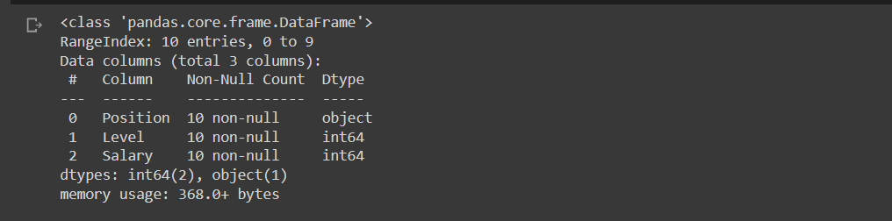
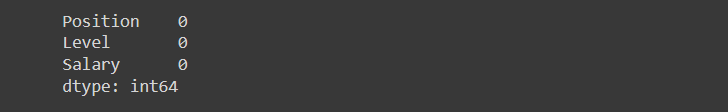
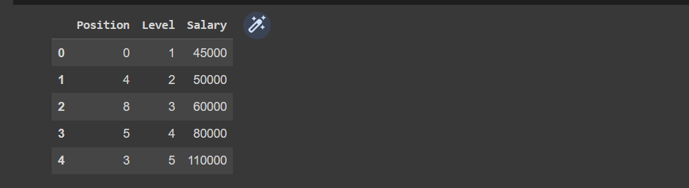
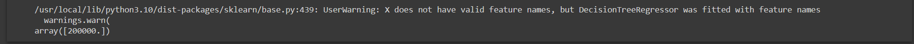

# Implementation-of-Decision-Tree-Regressor-Model-for-Predicting-the-Salary-of-the-Employee

## AIM:
To write a program to implement the Decision Tree Regressor Model for Predicting the Salary of the Employee.

## Equipments Required:
1. Hardware – PCs
2. Anaconda – Python 3.7 Installation / Jupyter notebook

## Algorithm
1. Import the standard libraries.
2.Upload the dataset and check for any null values using .isnull() function. 
3. Import LabelEncoder and encode the dataset.
4. Import DecisionTreeRegressor from sklearn and apply the model on the dataset.
5. Predict the values of arrays.
6. Import metrics from sklearn and calculate the MSE and R2 of the model on the dataset
7.Predict the values of array.
8. Apply to new unknown values.

## Program:
```
Program to implement the Decision Tree Regressor Model for Predicting the Salary of the Employee.
Developed by: 212222230098
RegisterNumber: NITEESH M

import pandas as pd
data=pd.read_csv("Salary.csv")

data.head()

data.info()

data.isnull().sum()

from sklearn.preprocessing import LabelEncoder
le=LabelEncoder()

data["Position"]=le.fit_transform(data["Position"])
data.head()

x=data[["Position","Level"]]
x.head()

y=data[["Salary"]]

from sklearn.model_selection import train_test_split
x_train, x_test, y_train, y_test=train_test_split(x,y,test_size=0.2,random_state=2)

from sklearn.tree import DecisionTreeRegressor
dt=DecisionTreeRegressor()
dt.fit(x_train,y_train)
y_pred=dt.predict(x_test)

from sklearn import metrics
mse=metrics.mean_squared_error(y_test, y_pred)
mse

r2=metrics.r2_score(y_test,y_pred)
r2

dt.predict([[5,6]])

```

## Output:
## Initial dataset:


## Data Info:


## Optimization of null values:


## Converting string literals to numerical values using label encoder:


## Mean Squared Error:


## R2 (variance):


## Prediction:


## Result:
Thus the program to implement the Decision Tree Regressor Model for Predicting the Salary of the Employee is written and verified using python programming.
